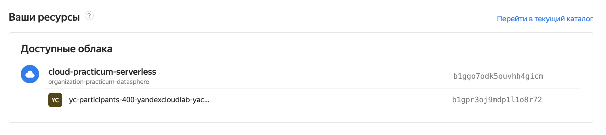

# Настройка окружения для практикума «Веб-приложение на Serverless»

# Оглавление
1. [Предварительная инсталяция](#Предварительная-инсталяция)
2. [Получение логина и пароля](#Получение-логина-и-пароля)
3. [Конфигурирование консольных утилит](#Конфигурирование-консольных-утилит)

# Предварительная инсталяция

Для работы вам потребуются:

- WebStorm(или любая другая среда разработки с поддержкой typescript)
- Node.js >= 16.9.1
- Typescript
- yc (Yandex Cloud CLI)
- aws (Amazon Web Services CLI)
- Docker
- Terraform >= 1.0.8
- curl
- git

Ниже описаны шаги для их установки на различных операционных системах.

### Windows

- [Установите WSL](https://docs.microsoft.com/en-us/windows/wsl/install)
- Запустите Ubuntu Linux
- Настройте согласно инструкции для Ubuntu Linux

### Ubuntu Linux

В случае Linux отличного от Ubuntu, установите те же пакеты, используя пакетный менеджер вашего дистрибутива.

#### WebStorm

```bash
sudo snap install webstorm --classic
```

#### Node.js

Установите [Node.js](https://nodejs.org/en/download/current/) версии не ниже `16.9.1`:

```bash
sudo apt-get install curl
curl -sL https://deb.nodesource.com/setup_16.x | sudo -E bash
sudo apt-get install nodejs
node -v
npm -v
```

#### Typescript

```bash
sudo npm install -g typescript
```

#### yc CLI

Установите [yc CLI](https://cloud.yandex.ru/docs/cli/operations/install-cli#interactive):

```bash
curl https://storage.yandexcloud.net/yandexcloud-yc/install.sh | bash
exec -l $SHELL
yc version
```

Настройте профиль по [инструкции](https://cloud.yandex.ru/docs/cli/operations/profile/profile-create#interactive-create) сразу после получения логина и пароля.

#### aws CLI

Установите [aws CLI](https://docs.aws.amazon.com/cli/latest/userguide/install-cliv2-linux.html):

```bash
curl "https://awscli.amazonaws.com/awscli-exe-linux-x86_64.zip" -o "awscliv2.zip"
unzip awscliv2.zip
sudo ./aws/install
```

Сконфигурируйте по [инструкции](https://cloud.yandex.ru/docs/ydb/quickstart/document-api/aws-setup).

#### Docker

Установите [docker](https://docs.docker.com/engine/install/ubuntu/):

```bash
sudo apt-get update
sudo apt-get install apt-transport-https ca-certificates curl gnupg lsb-release -y
curl -fsSL https://download.docker.com/linux/ubuntu/gpg | sudo gpg --dearmor -o /usr/share/keyrings/docker-archive-keyring.gpg
echo "deb [arch=$(dpkg --print-architecture) signed-by=/usr/share/keyrings/docker-archive-keyring.gpg] https://download.docker.com/linux/ubuntu \
  $(lsb_release -cs) stable" | sudo tee /etc/apt/sources.list.d/docker.list > /dev/null
sudo apt-get update
sudo apt-get install docker-ce docker-ce-cli containerd.io -y
sudo docker run hello-world
```

Настройте [запуск docker без sudo](https://docs.docker.com/engine/install/linux-postinstall/#manage-docker-as-a-non-root-user):

```bash
sudo groupadd docker
sudo usermod -aG docker $USER
newgrp docker
docker run hello-world
```

#### Terraform

Установите [terraform](https://learn.hashicorp.com/tutorials/terraform/install-cli) версии не ниже `1.0.8`:

```bash
sudo apt-get update && sudo apt-get install -y gnupg software-properties-common curl
curl -fsSL https://apt.releases.hashicorp.com/gpg | sudo apt-key add -
sudo apt-add-repository "deb [arch=$(dpkg --print-architecture)] https://apt.releases.hashicorp.com $(lsb_release -cs) main"
sudo apt-get update && sudo apt-get install terraform -y
terraform version
```

#### Прочее

```bash
sudo apt-get install curl git -y
```

### MacOS

Установите [brew](https://brew.sh):

```bash
/bin/bash -c "$(curl -fsSL https://raw.githubusercontent.com/Homebrew/install/HEAD/install.sh)"
```

#### WebStorm

Скачать дистрибутив WebStorm можно [здесь](https://www.jetbrains.com/ru-ru/webstorm/download/#section=mac).

#### Node.js

Установите [Node.js](https://nodejs.org/en/download/current/) версии не ниже `16.9.1`:

```bash
brew install node
node -v  
npm -v  
```

#### Typescript

```bash
npm install -g typescript
```

#### yc CLI

Установите [yc CLI](https://cloud.yandex.ru/docs/cli/operations/install-cli#interactive):

```bash
curl https://storage.yandexcloud.net/yandexcloud-yc/install.sh | bash
exec -l $SHELL
yc version
```

Настройте профиль по [инструкции](https://cloud.yandex.ru/docs/cli/operations/profile/profile-create#interactive-create) сразу после получения логина и пароля.


#### aws CLI

Установите [aws CLI](https://docs.aws.amazon.com/cli/latest/userguide/install-cliv2-mac.html):

```bash
curl "https://awscli.amazonaws.com/AWSCLIV2.pkg" -o "AWSCLIV2.pkg"
sudo installer -pkg AWSCLIV2.pkg -target /
```

Сконфигурируйте по [инструкции](https://cloud.yandex.ru/docs/ydb/quickstart/document-api/aws-setup).

#### docker

Установите docker по [инструкции](https://docs.docker.com/desktop/mac/install/).

#### terraform

```bash
brew tap hashicorp/tap
brew install hashicorp/tap/terraform
terraform version
```

#### Прочее

```bash
brew install curl git
```

# Получение логина и пароля
Примерно за сутки до практикума вы получите специально письмо с логином и паролем для доступа в облако. Вам необходимо использовать их для входа в веб-консоль Yandex.Cloud. Войдя в консоль Yandex.Cloud определите название вашего рабочего каталога, его имя будет соответсовать вашему логину: если ваш логин `yc.participants-400@yandexcloudlab.yaconnect.com` то рабочий каталог будет называться `yc-participants-400-yandexcloudlab-yaconnect-com` 



Не выходите из веб-консоли Yandex.Cloud и приступите к следующему пункту инструкции.


# Конфигурирование консольных утилит
## Настройте профиль yc CLI
Настройте профиль yc CLI по [инструкции](https://cloud.yandex.ru/docs/cli/operations/profile/profile-create#interactive-create).

## Настройте профиль aws CLI

Для конфигурирования профиля aws CLI потребуется создать сервисный аккаунт, выдать ему права и получить идентификатор ключа и ключ доступа созданного сервисного аккаунта. Для всего этого используйте имя вашего пользователя как имя, например: если ваш логин `yc.participants-400@yandexcloudlab.yaconnect.com` то имя должно быть `yc-participants-400`.

Произведите настройку профиля aws CLI по [инструкции](https://cloud.yandex.ru/docs/ydb/quickstart/document-api/aws-setup).
