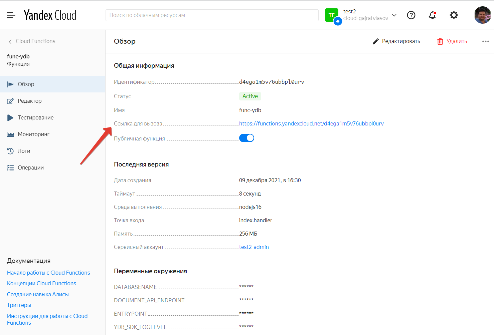

# Порядок deploy

Deploy осуществляется с помощью yc

Утановите yc и создайте профиль

### Начало работы с интерфейсом командной строки
https://cloud.yandex.ru/docs/cli/quickstart

### Получите токен как указано в документации:
https://cloud.yandex.ru/docs/iam/concepts/authorization/oauth-token

### Создайте профиль
yc init

// создается профиль с меткой as006 
yc config profile create as006

// установите ранее полученный токен 
yc config set --token AQAAA*************

// установите id каталога и облака 
yc config set folder-id b1gt***************
yc config set cloud-id b1gc**************

// посмотрите профили, которые Вы ранее создавали в yc:  
yc config profile list

// проконтролируйте ранее введенные параметры 
yc config profile get as006

### установите парсер json - нужен для yc
**! Внимание**

Если Вы запускаете пример из под windows - не заюудьте перейти в среду wsl (ubuntu) Windows 10 и все дальнейшие команды давать только из WSL. 

sudo apt-get install jq

### Заполните Вашими данными .env
Данные, хранящиеся в main.env не являются секретами - поэтому я специально включил его в репозитарий заполнив реальными данными. 

Замените данные из примера своими - иначе deploy не сработает.

# Запуск deploy
### Из корня проекта запустите:
./deploy/create-func.sh

Эта команда создает новую функцию и делает ее публичной.

Запустите установку зависимостей:

npm install

В частности проект компилируется с помощью TSC.

Далее запускайте создание экземпляра функции: 

./deploy/create-func-ver.sh

Скрипт разделен на две части потому что Вам потребуется один раз создать функцию и по мере разработки запускать создание версий функции.

Обратие внимание что при создании версии функции автоматически создаются и заполняются необходимые для работы функции env переменные.

# Вниманию windows пользователей!
Скрипты написаны под lunix bash

Под windows их можно запустить из среды wsl (встроенная в windows виртуальная машина ubuntu)

Также необходимо проконтролировать что при импорте из github в файлах *.sh у Вас перевод картеки установлен только в LF - иначе скрипты выдадут ошибку.

В некоторых случаях на скрипты необходимо дать права на исполнение.

Пакет dotenv (кросплатформенное чтение env переменных) обязательно необходим для windows для чтения информации из env файлов. 

# Тестирование

Перейдите в Cloud Functions в web интерфейсе.

Нажмите на ссылку (первый скрипт сделал функцию публичной).
Добавьте параметр api_key, например ?api_key=b95

Будет создана таблица b95 и в нее будет добавлена одна запись.

