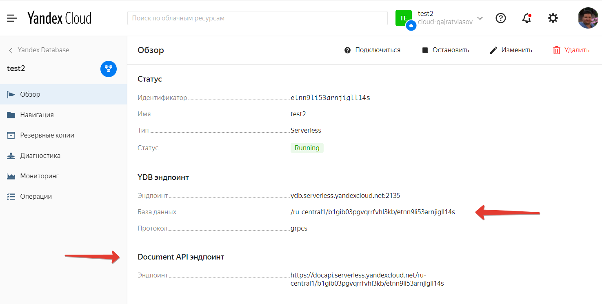

# Авторизация в Yandex database c помощью сервиса метаданных.

# Документация
[Авторизация в YDB CLI](https://cloud.yandex.ru/docs/ydb/ydb-cli/authorization)

## Где работает сервис метаданных
Сервис метаданных работает на виртуальных машинах внутри Yandex compute cloud, а также в serverless функциях Yandex

## Данный пример представляет собой отдельный проект по развертыванию NodeJS serverless функции

Для запуска Вам необходимо:

1. клонировать репозитарий
2. установить зависимости командой npm i
3. убедитесь что у Вас в базе данных есть таблица series (если нет - то создайте таблицу с любыми полями)
4. внесите Ваши данные в main.env (DOCUMENT_API_ENDPOINT и DATABASENAME)

 Эти данные Вы можете взять из окна свойств Вашей базы данных

6. следуйте инструкциям в deploy/deploy.md для deploy функции
7. вызовите функцию и Вы увидите json с описанием полей таблицы series

Пример на python
https://cloud.yandex.ru/docs/functions/solutions/connect-to-ydb#create-function
